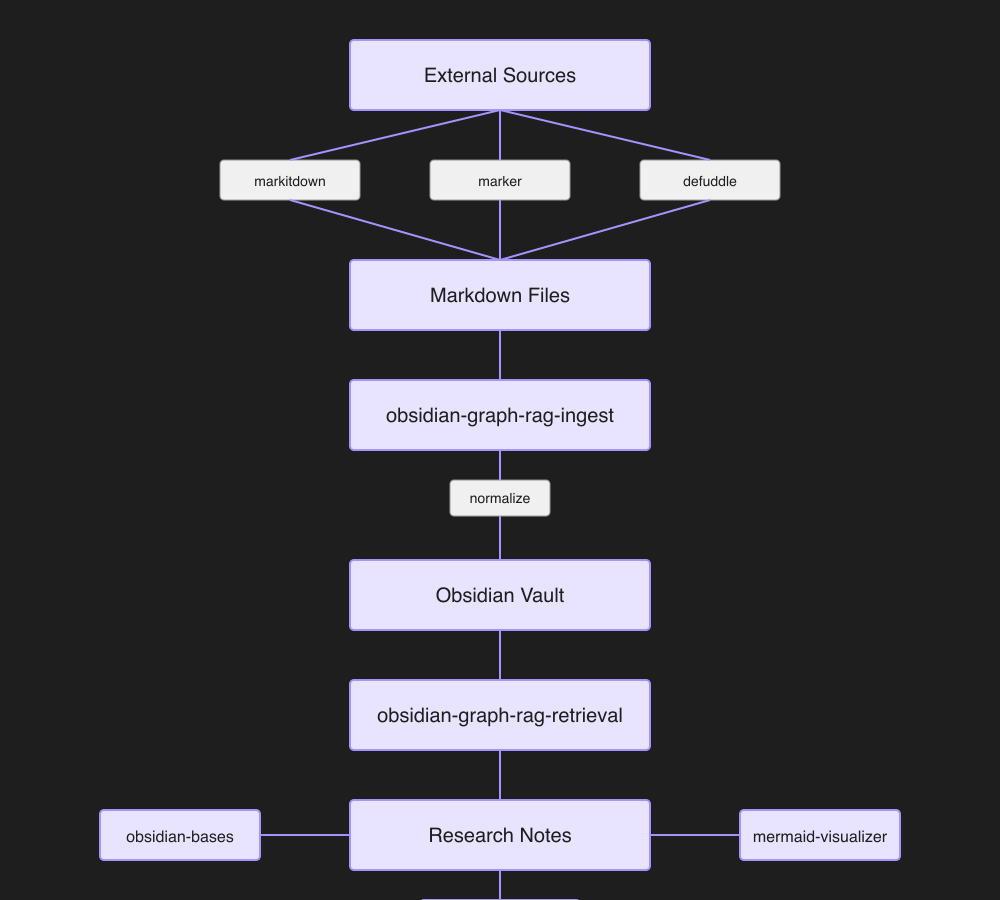
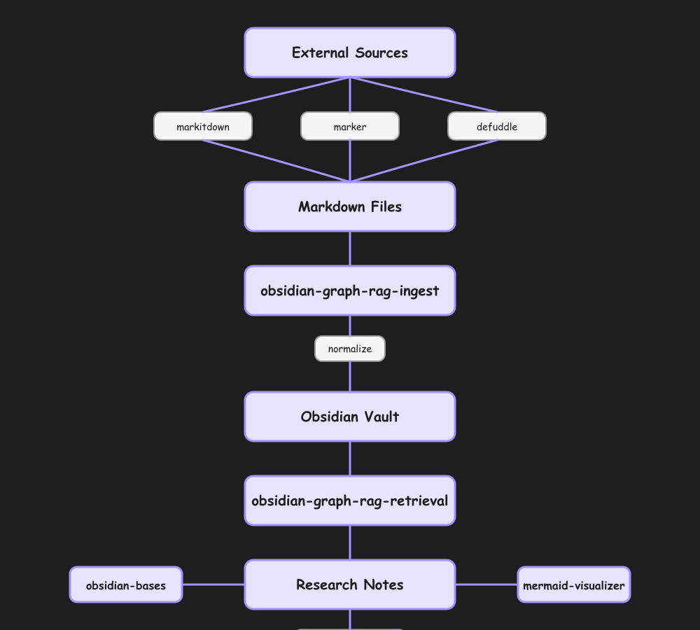
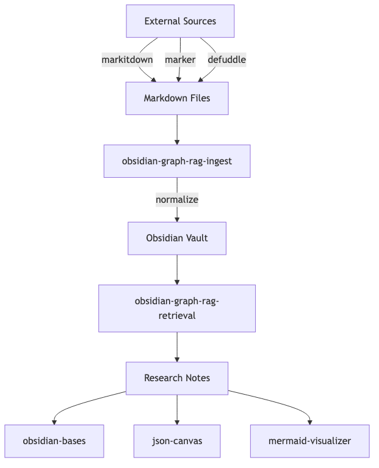

Agent Skills for use with Obsidian.

These skills follow the [Agent Skills specification](https://agentskills.io/specification) so they can be used by any skills-compatible agent, including Claude Code and Codex CLI.

## Installation

### Marketplace

```
/plugin marketplace add kepano/obsidian-skills
/plugin install obsidian@obsidian-skills
```

### npx skills

```
npx skills add git@github.com:kepano/obsidian-skills.git
```

### Manually

#### Claude Code

Add the contents of this repo to a `/.claude` folder in the root of your Obsidian vault (or whichever folder you're using with Claude Code). See more in the [official Claude Skills documentation](https://platform.claude.com/docs/en/agents-and-tools/agent-skills/overview).

#### Codex CLI

Copy the `skills/` directory into your Codex skills path (typically `~/.codex/skills`). See the [Agent Skills specification](https://agentskills.io/specification) for the standard skill format.

#### OpenCode

Clone the entire repo into the OpenCode skills directory (`~/.opencode/skills/`):

```sh
git clone https://github.com/kepano/obsidian-skills.git ~/.opencode/skills/obsidian-skills
```

Do not copy only the inner `skills/` folder — clone the full repo so the directory structure is `~/.opencode/skills/obsidian-skills/skills/<skill-name>/SKILL.md`.

OpenCode auto-discovers all `SKILL.md` files under `~/.opencode/skills/`. No changes to `opencode.json` or any config file are needed. Skills become available after restarting OpenCode.

## Skills

### By Category

| Category | Skills | Purpose |
|----------|--------|---------|
| **Content Ingestion** | [markitdown](skills/markitdown), [marker](skills/marker), [defuddle](skills/defuddle) | Import external files and web pages into Markdown |
| **Vault Operations** | [obsidian-cli](skills/obsidian-cli) | Read, write, search, and evaluate Obsidian vaults via CLI |
| **Content Authoring** | [obsidian-markdown](skills/obsidian-markdown) | Write valid Obsidian Flavored Markdown with templates and quality checks |
| **Visualization** | [mermaid-visualizer](skills/mermaid-visualizer), [excalidraw-diagram](skills/excalidraw-diagram), [json-canvas](skills/json-canvas), [obsidian-bases](skills/obsidian-bases) | Diagram, canvas, and database views of your notes |
| **Workflows** | [obsidian-graph-rag](skills/obsidian-graph-rag), [obsidian-graph-rag-ingest](skills/obsidian-graph-rag-ingest), [obsidian-graph-rag-retrieval](skills/obsidian-graph-rag-retrieval) | Orchestrate graph-native RAG: ingest sources, retrieve answers, synthesize notes |
| **Meta** | [skill-spec](skills/skill-spec) | Validate skills and scaffold new ones per the Agent Skills spec |

### Full Index

| Skill | Description |
|-------|-------------|
| [obsidian-markdown](skills/obsidian-markdown) | Create and edit [Obsidian Flavored Markdown](https://help.obsidian.md/obsidian-flavored-markdown) (`.md`) with wikilinks, embeds, callouts, properties, and other Obsidian-specific syntax |
| [obsidian-bases](skills/obsidian-bases) | Create and edit [Obsidian Bases](https://help.obsidian.md/bases/syntax) (`.base`) with views, filters, formulas, and summaries |
| [json-canvas](skills/json-canvas) | Create and edit [JSON Canvas](https://jsoncanvas.org/) files (`.canvas`) with nodes, edges, groups, and connections |
| [obsidian-cli](skills/obsidian-cli) | Interact with Obsidian vaults via the [Obsidian CLI](https://help.obsidian.md/cli) including plugin and theme development |
| [defuddle](skills/defuddle) | Extract clean markdown from web pages using [Defuddle](https://github.com/kepano/defuddle-cli), removing clutter to save tokens |
| [markitdown](skills/markitdown) | Convert files (PDF, Word, PowerPoint, Excel, images, audio, HTML, ZIP, YouTube, and more) to Markdown for use in Obsidian vaults and LLM pipelines |
| [marker](skills/marker) | Convert PDFs and images to high-quality Markdown using deep-learning visual layout analysis, ideal for complex tables and multi-column documents |
| [excalidraw-diagram](skills/excalidraw-diagram) | Generate Excalidraw diagrams from text content, creating Obsidian-ready `.md` files with flowcharts, mind maps, hierarchies, and more |
| [mermaid-visualizer](skills/mermaid-visualizer) | Transform text content into professional Mermaid diagrams for presentations and documentation, with built-in syntax error prevention |
| [obsidian-graph-rag](skills/obsidian-graph-rag) | End-to-end graph-native RAG workflow; orchestrates ingest and retrieval sub-skills |
| [obsidian-graph-rag-ingest](skills/obsidian-graph-rag-ingest) | Prepare and import external content into an Obsidian Vault for graph-native RAG |
| [obsidian-graph-rag-retrieval](skills/obsidian-graph-rag-retrieval) | Multi-turn, graph-native retrieval and synthesis from a prepared Obsidian Vault |
| [skill-spec](skills/skill-spec) | Validate existing skills or initialize new skills according to the [Agent Skills specification](https://agentskills.io/specification) |

### Common Workflows

1. **Import & Normalize External Documents**  
   `markitdown` / `marker` → `obsidian-markdown`  
   Convert files into Markdown, then normalize frontmatter, links, and attachments for the vault.

2. **Research & Synthesize**  
   `obsidian-graph-rag-ingest` → `obsidian-graph-rag-retrieval` → `obsidian-markdown` → (`obsidian-bases` / `json-canvas`)  
   Import sources, run graph-native retrieval, generate a research note, and optionally create a tracking dashboard or canvas.

3. **Augment from the Web**  
   `defuddle` → `obsidian-markdown`  
   Fetch and clean web content, then save it as a properly formatted Obsidian note.

4. **Visualize Ideas**  
   `obsidian-markdown` → `mermaid-visualizer` / `excalidraw-diagram` / `json-canvas`  
   Turn note content into diagrams or canvases.

### Validation

All skills follow the [Agent Skills specification](https://agentskills.io/specification). To validate a skill:

```bash
python3 skills/skill-spec/scripts/validate.py skills/<skill-name>
```

## Demos

### JSON Canvas

Create visual canvases with nodes, edges, and groups for mind maps, project boards, and research layouts.



### Excalidraw Diagrams

Generate hand-drawn style diagrams including flowcharts, mind maps, relationship diagrams, and timelines.



### Mermaid Visualizations

Transform text into professional Mermaid diagrams optimized for presentations and documentation.


