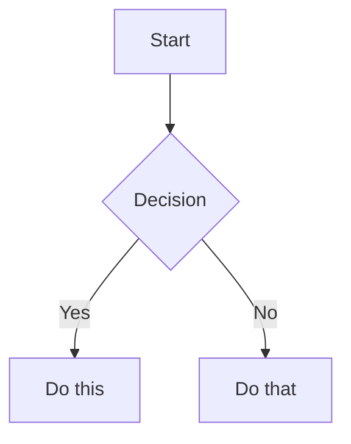

# Obsidian Flavored Markdown Skill

Create and edit valid Obsidian Flavored Markdown. Obsidian extends CommonMark and GFM with wikilinks, embeds, callouts, properties, comments, and other syntax. This skill covers only Obsidian-specific extensions -- standard Markdown (headings, bold, italic, lists, quotes, code blocks, tables) is assumed knowledge.

## Before You Generate: Note Intent

Before creating a note, clarify:

1. **Note type**: project note, meeting note, literature note, daily note, MOC (index), atomic note, or reference note.
2. **Target audience**: yourself, your team, or public readers.
3. **Relationship to existing notes**: should it link to existing notes, replace one, or stand alone?
4. **Filename convention**: use clear, vault-consistent names (e.g., `Project Alpha.md`, `2024-01-15 Team Sync.md`, `Literature - Smith 2020.md`).

Prefer English or pinyin filenames if the vault is synced or searched across devices; keep display text human-readable via `title` and `aliases`.

## Workflow: Creating an Obsidian Note

1. **Determine note type and intent**.
2. **Choose or adapt a template** from [Note Templates](#note-templates).
3. **Draft an outline** with continuous heading levels (H1 → H2 → H3); do not skip levels.
4. **Write content** using standard Markdown for structure, plus Obsidian-specific syntax below.
5. **Link related notes** using `[[wikilinks]]` for internal vault connections, or standard Markdown links for external URLs.
6. **Embed content** from other notes, images, or PDFs using the `![[embed]]` syntax.
7. **Add callouts** for highlighted information using `> [!type]` syntax.
8. **Complete frontmatter** with title, tags, aliases, status, dates, and related links.
9. **Run the [Quality Checklist](#quality-checklist)** before finishing.

> When choosing between wikilinks and Markdown links: use `[[wikilinks]]` for notes within the vault (Obsidian tracks renames automatically) and `[text](url)` for external URLs only.

## Note Templates

Use these templates as starting points. Adjust frontmatter and sections to fit the note.

### Project Note

```markdown
---
title: Project Alpha
tags:
  - project
  - active
status: in-progress
start-date: 2024-01-15
due-date: 2024-06-30
aliases:
  - Alpha Project
related:
  - "[[Project Alpha MOC]]"
---

# Project Alpha

> [!info] Overview
> One-sentence description of the project's goal.

## Goals

## Tasks

- [ ] Task 1

## Notes

## References
```

### Meeting Note

```markdown
---
title: Team Sync - 2024-01-15
tags:
  - meeting
  - team
date: 2024-01-15
attendees:
  - Alice
  - Bob
aliases:
  - "[[Team Sync 2024-01-15]]"
---

# Team Sync - 2024-01-15

> [!info] Meta
> Date: 2024-01-15 | Attendees: Alice, Bob

## Agenda

## Decisions

## Action Items

- [ ] Alice: ...
- [ ] Bob: ...

## Notes

## Related
```

### Literature Note

```markdown
---
title: "Literature - Smith 2020"
tags:
  - literature
  - ai
author: Smith
year: 2020
source: "https://doi.org/..."
aliases:
  - Smith 2020
---

# Literature - Smith 2020

## Summary

## Key Ideas

## Quotes

## My Thoughts

## Related Notes
```

### MOC (Map of Content)

```markdown
---
title: Knowledge Area MOC
tags:
  - moc
aliases:
  - Knowledge Area Index
---

# Knowledge Area MOC

> [!tip] This is a curated index of related notes.

## Core Concepts

- [[Concept A]]
- [[Concept B]]

## Projects

## References
```

### Atomic Note

```markdown
---
title: One Idea
tags:
  - atomic
aliases:
  - Idea Name
---

# One Idea

One focused idea, explained in your own words.

## Related

- [[Related Note]]
```

### Research Note

Use this template for synthesizing retrieval results or research sessions, for example with `obsidian-graph-rag-retrieval`.

```markdown
---
title: "RAG Research: {{query}}"
session_id: "{{session_id}}"
turn: {{turn}}
confidence: {{confidence}}
date: {{date}}
tags:
  - rag-research
  - "{{tags}}"
aliases:
  - "{{query}} Research"
related:
  - "[[RAG Session {{session_id}}]]"
---

# {{query}} Research

> [!summary] AI Synthesis
> {{summary}}

## Key Context

{{#each retrieved}}
- [[{{basename}}]] %%graph score: {{score}}, depth: {{depth}}%%
{{/each}}

## Graph

```mermaid
graph TD
{{#each edges}}
    {{from}} --> {{to}}
{{/each}}
```

%% retrieval trace saved to .obsidian-rag-session/ %%
```

## Internal Links (Wikilinks)

```markdown
[[Note Name]]                          Link to note
[[Note Name|Display Text]]             Custom display text
[[Note Name#Heading]]                  Link to heading
[[Note Name#^block-id]]                Link to block
[[#Heading in same note]]              Same-note heading link
```

Define a block ID by appending `^block-id` to any paragraph:

```markdown
This paragraph can be linked to. ^my-block-id
```

For lists and quotes, place the block ID on a separate line after the block:

```markdown
> A quote block

^quote-id
```

## Linking Strategy

Obsidian's value comes from connected notes. When generating content:

- Link the **first mention** of an existing concept with `[[Concept]]`.
- If a concept has no matching note, decide whether to create one or leave an unlinked mention.
- Group related notes with a **MOC** (Map of Content) note.
- Prefer **meaningful links** over linking every noun.
- Use `aliases` so a note can be found by multiple names.
- Avoid orphan notes: every new note should be linked from at least one other note or MOC when possible.

## Embeds

Prefix any wikilink with `!` to embed its content inline:

```markdown
![[Note Name]]                         Embed full note
![[Note Name#Heading]]                 Embed section
![[image.png]]                         Embed image
![[image.png|300]]                     Embed image with width
![[document.pdf#page=3]]               Embed PDF page
```

See [EMBEDS.md](references/EMBEDS.md) for audio, video, search embeds, and external images.

## Attachments

- Store images, PDFs, audio, and video in a dedicated folder such as `attachments/`, `assets/`, or `_attachments/`.
- Use relative paths in embeds: `![[attachments/screenshot.png]]`.
- Add a description when embedding images: `![[image.png|description|300]]`.
- Keep filenames descriptive and avoid spaces when possible.

## Callouts

```markdown
> [!note]
> Basic callout.

> [!warning] Custom Title
> Callout with a custom title.

> [!faq]- Collapsed by default
> Foldable callout (- collapsed, + expanded).
```

Common types: `note`, `tip`, `warning`, `info`, `example`, `quote`, `bug`, `danger`, `success`, `failure`, `question`, `abstract`, `todo`.

See [CALLOUTS.md](references/CALLOUTS.md) for the full list with aliases, nesting, and custom CSS callouts.

## Properties (Frontmatter)

```yaml
---
title: My Note
date: 2024-01-15
tags:
  - project
  - active
aliases:
  - Alternative Name
cssclasses:
  - custom-class
---
```

Default properties: `tags` (searchable labels), `aliases` (alternative note names for link suggestions), `cssclasses` (CSS classes for styling).

See [PROPERTIES.md](references/PROPERTIES.md) for all property types, tag syntax rules, and advanced usage.

## Metadata Strategy

Choose the right tool for categorization:

- **`tags`**: broad, stable categories (`#project`, `#ai`). Use for filtering and Dataview queries.
- **`links`**: relationships between specific notes (`[[Related Note]]`). Use when the target is a first-class note.
- **`properties`**: structured data such as `status`, `author`, `source`, `date`, `priority`.
- **`aliases`**: alternative names or abbreviations for the same note.

You may also add domain-specific properties as needed. For example, RAG/research notes might include `session_id`, `turn`, and `confidence`; project notes might include `start-date`, `due-date`, and `priority`.

Design properties consistently if you plan to query notes with [`obsidian-bases`](../obsidian-bases/SKILL.md). Bases relies on stable field names and types for filters, formulas, and views.

Recommended custom properties for generated notes:

| Property | Type | Use case |
|----------|------|----------|
| `status` | text | `draft`, `in-progress`, `done`, `archived` |
| `date` | date | creation or event date |
| `updated` | date | last significant edit |
| `source` | text | URL, book, paper, or person |
| `author` | text | original author of cited work |
| `related` | list | explicit `[[wikilinks]]` to related notes |
| `priority` | text | `high`, `medium`, `low` |

## Tags

```markdown
#tag                    Inline tag
#nested/tag             Nested tag with hierarchy
```

Tags can contain letters, numbers (not first character), underscores, hyphens, and forward slashes. Tags can also be defined in frontmatter under the `tags` property.

Both YAML list and inline array syntax are valid:

```yaml
tags:
  - project
  - active

# or
tags: [project, active]
```

## Comments

```markdown
This is visible %%but this is hidden%% text.

%%
This entire block is hidden in reading view.
%%
```

Use comments to attach machine-readable metadata (e.g., scores, depths, provenance) without cluttering reading view:

```markdown
- [[Source Note]] %%graph score: 12, depth: 2%%
```

## Obsidian-Specific Formatting

```markdown
==Highlighted text==                   Highlight syntax
```

## Math (LaTeX)

```markdown
Inline: $e^{i\pi} + 1 = 0$

Block:
$$
\frac{a}{b} = c
$$
```

## Diagrams (Mermaid)

````markdown

````

To link Mermaid nodes to Obsidian notes, add `class NodeName internal-link;`.

> For complex diagrams generated from text, use [`mermaid-visualizer`](../mermaid-visualizer/SKILL.md).  
> For hand-drawn style diagrams, use [`excalidraw-diagram`](../excalidraw-diagram/SKILL.md).  
> For Obsidian Canvas files, use [`json-canvas`](../json-canvas/SKILL.md).

## Footnotes

```markdown
Text with a footnote[^1].

[^1]: Footnote content.

Inline footnote.^[This is inline.]
```

## Atomic Notes & Long Documents

- **One idea per atomic note**: keep the scope narrow so the note can be reused and linked in many contexts.
- **Split when a note exceeds 500-800 words** or covers multiple distinct topics.
- **Use a MOC** to connect atomic notes into a larger narrative.
- **Preserve context** by linking from the original long note to the new atomic notes.

## Complete Example

````markdown
---
title: Project Alpha
date: 2024-01-15
tags:
  - project
  - active
status: in-progress
---

# Project Alpha

This project aims to [[improve workflow]] using modern techniques.

> [!important] Key Deadline
> The first milestone is due on ==January 30th==.

## Tasks

- [x] Initial planning
- [ ] Development phase
  - [ ] Backend implementation
  - [ ] Frontend design

## Notes

The algorithm uses $O(n \log n)$ sorting. See [[Algorithm Notes#Sorting]] for details.

![[Architecture Diagram.png|600]]

Reviewed in [[Meeting Notes 2024-01-10#Decisions]].
````

## Quality Checklist

Before finishing a note, verify:

- [ ] frontmatter is at the very top and YAML is valid.
- [ ] `title` is filled and matches or complements the filename.
- [ ] `tags` use lowercase, no spaces, and follow vault conventions.
- [ ] Heading levels are continuous (no H1 → H3 skips).
- [ ] Every `[[wikilink]]` points to an existing note or an intentional new note.
- [ ] Every `![[embed]]` uses the correct relative path.
- [ ] Attachments are stored in the designated folder.
- [ ] Important information is highlighted with callouts.
- [ ] There are no leftover placeholders such as `TODO`, `FIXME`, or `Lorem ipsum`.
- [ ] The note is linked from at least one other note or MOC (avoid orphans).

## Common Pitfalls

- **Spaces in wikilink targets**: Obsidian resolves them, but links break more easily. Prefer `[[Note Name]]` over `[[Note Name]]` with inconsistent casing.
- **Duplicate aliases**: an alias should map to only one note.
- **Tags with spaces or special characters**: use `multi-word-tag` or `#multi-word-tag`, not `#multi word tag`.
- **Block IDs on the wrong line**: place block IDs on the same line as the paragraph, or on their own line after lists/quotes.
- **Frontmatter after content**: YAML frontmatter must be the first thing in the file.
- **Over-linking**: not every noun needs a wikilink; link concepts that add value.

## References

- [Obsidian Flavored Markdown](https://help.obsidian.md/obsidian-flavored-markdown)
- [Internal links](https://help.obsidian.md/links)
- [Embed files](https://help.obsidian.md/embeds)
- [Callouts](https://help.obsidian.md/callouts)
- [Properties](https://help.obsidian.md/properties)
- [obsidian-graph-rag-retrieval export templates](../obsidian-graph-rag-retrieval/references/EXPORT-TEMPLATES.md)

This skill follows the [Agent Skills specification](https://agentskills.io/specification). Validate with [`skill-spec`](../skill-spec/scripts/validate.py).
